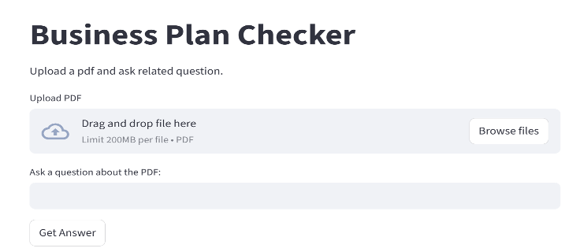
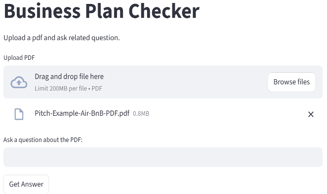
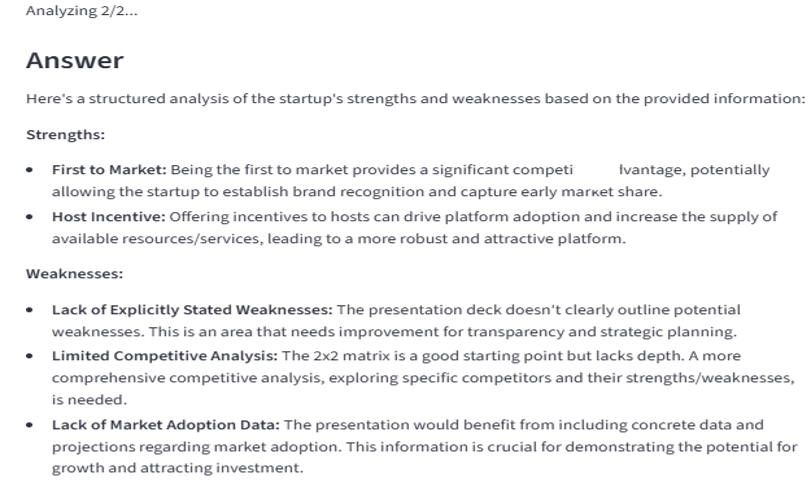

📊 Business Plan Checker

An AI-powered web application that analyzes **Business Plan PDFs** and answers user queries intelligently using **Large Language Models (LLMs)**.  
Built with **Streamlit** and powered by the **Groq API (LLaMA 3.1)** for fast, free inference.

---
## 🎯 Problem Statement

Reading long business plan PDFs is time-consuming and makes it difficult to quickly extract actionable insights.

## 💡 Solution

Business Plan Checker uses Large Language Models to automatically analyze uploaded PDFs, split them into chunks, and answer user questions by combining insights from multiple sections — helping users understand business ideas faster.

🌐 Live Demo

🚀 **Access the deployed application here:**  
👉 https://business-plan-checker-vuxxyztsw3gcve2eqcxton.streamlit.app/


🚀 Key Features

- Upload a **Business Plan PDF**
- Ask **custom questions** related to the document
- Intelligent **chunk-wise document analysis**
- Combines insights from multiple chunks into a **single structured answer**
- Fast responses using **Groq LLaMA 3.1 model**
- Simple and interactive **Streamlit UI**

---

🧠 How It Works

1. User uploads a PDF business plan
2. The PDF text is extracted using `PyPDF2`
3. Text is split into manageable chunks
4. Each chunk is analyzed using an LLM
5. Individual answers are combined into a **final clean response**

---
## 📊 Output

The application provides:

- AI-generated answers to custom business questions  
- Structured summaries combined from multiple PDF chunks  
- Fast LLM responses using Groq LLaMA 3.1  
- Clean and interactive Streamlit interface  
---
## 📸 Application Preview

<p align="center">
  
  
  
</p>

<p align="center">
Home Screen • PDF Upload • AI Analysis Result
</p>

---

🛠️ Tech Stack

- **Python**
- **Streamlit** – frontend & deployment
- **PyPDF2** – PDF text extraction
- **Groq API** – LLaMA 3.1 language model
- **python-dotenv** – environment variable management

---

📂 Project Structure

```text
Business Plan Checker/
│
├── app.py                # Main Streamlit application
├── requirements.txt      # Python dependencies
├── README.md             # Project documentation
```
---
## 🎓 What I Learned

- Building Generative AI applications using Streamlit  
- Implementing PDF ingestion and text extraction pipelines  
- Chunk-based document processing for large files  
- Integrating Groq LLaMA models for fast inference  
- Designing end-to-end AI workflows
---
## 🧩 Challenges Faced

- Handling large PDF files efficiently  
- Designing chunk-based document processing  
- Integrating LLM responses meaningfully  
- Maintaining fast inference with limited resources  
---

## 🚀 Future Improvements

- Add multiple document support  
- Improve retrieval accuracy  
- Add user authentication  
- Deploy with scalable backend  


